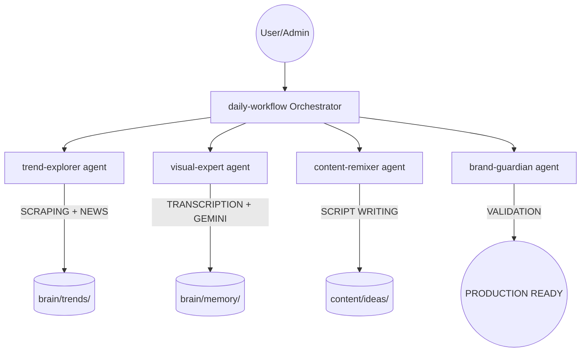

# 🚀 AI Automation Content Creation Factory | Creators LATAM

 

> **EN**: Specialized architecture for semi-automated viral content production using **Antigravity AI IDE**, **n8n**, and Multimodal Agents.
>
> **ES**: Arquitectura especializada para la producción semi-automática de contenido viral usando **Antigravity AI IDE**, **n8n** y Agentes Multimodales.

---

## 🗺️ System Architecture | Arquitectura del Sistema

We use a **Hub-and-Spoke** model where specialized agents coordinate to transform raw trends into production-ready assets.

---

## ⚡ Key Features | Características Clave

- **Video as Code**: Production is a repeatable, modular software flow.
- **Hybrid Analysis**: Combines transcript text with visual frame analysis (Gemini 2.0).
- **Shared Memory**: Centralized "brain/" directory for cross-agent coordination.
- **Multimodal Focus**: Optimized for TikTok, Reels, and YouTube Shorts.

---

## 📂 Project Structure | Estructura

- `core/`: Agnostic versions of our specialized agents and skills.
- `docs/`: Technical guides and architecture deep-dives.
- `utils/`: Scripts for video analysis and trend scraping.

---

## 🤝 Collaboration | Colaboración

Estamos buscando colaboradores apasionados por la **Orquestación de Agentes** y la **Automatización de Contenido**. Si quieres sumarte al equipo o proponer mejoras:

- 📧 **Email**: [mvelascoo@tamibot.com](mailto:mvelascoo@tamibot.com)
- 💬 **WhatsApp**: [+51 995 547 575](https://wa.me/51995547575)

---

## 📜 Requirements | Requisitos

- **Google Antigravity IDE** (Public Preview).
- **Google AI API Key** (Gemini).
- **Python 3.10+**.

---

*Made with ❤️ by [Creators LATAM](https://creatorslatam.com) (Tamibot)*
