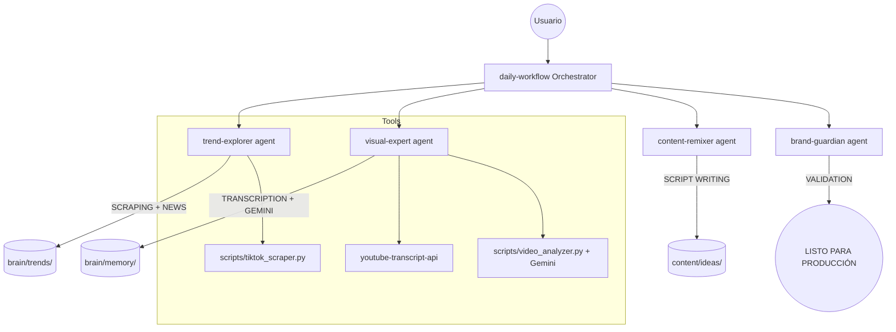

# Guía de Arquitectura — Agent Teams v2.1

Esta es la documentación técnica oficial del sistema de generación de contenido autónomo **Creators LATAM**.

---

## 🗺️ Diagrama de Flujo del Sistema

---

## 🎭 Roles y Responsabilidades

### 1. El Director de Orquesta (`daily-workflow`)
- **Misión**: Gestor estratégico. Divide el objetivo del usuario en misiones para los expertos.
- **Memoria**: Escribe en `task.md` para coordinar el estado del equipo.

### 2. El Radar (`trend-explorer`)
- **Misión**: Hallazgo de videos virales y noticias de última hora en IA.
- **Herramientas**: `tiktok_scraper.py`, `WebSearch` (Reddit, Hacker News).

### 3. El Ojo Clínico (`visual-expert`)
- **Misión**: Análisis híbrido. Combina la letra (transcripción) con la imagen (frames vía Gemini).
- **Herramientas**: `youtube-transcript-api`, `video_analyzer.py`.

### 4. El Alquimista (`content-remixer`)
- **Misión**: Escritura de guiones virales adaptados al tono de Creators LATAM y la estrategia de Serie A/B.

### 5. El Auditor (`brand-guardian`)
- **Misión**: Control de calidad final. Asegura que el contenido sea experto, veraz y dinámico.

---

## 🧠 Gestión de la Memoria Compartida (`brain/`)
Para evitar duplicidad de trabajo y saturación de IA, el sistema utiliza un "Cerebro Central":
- `/memory/analyses/`: Base de datos de ADN viral de videos analizados.
- `/trends/`: Noticias y hallazgos diarios.
- `/knowledge_base/`: Guías de estilo y estrategia de marca.

---

## 🛠️ Herramientas Utilizadas (Citas)
Este proyecto integra herramientas de la comunidad para potenciar el análisis:
- **YouTube Transcript API**: [https://github.com/jdepoix/youtube-transcript-api](https://github.com/jdepoix/youtube-transcript-api) (Extracción de texto).
- **Gemini Multimodal**: [https://ai.google.dev/](https://ai.google.dev/) (Visión artificial de videos).
- **Antigravity Framework**: Entorno agent-first para la orquestación.
